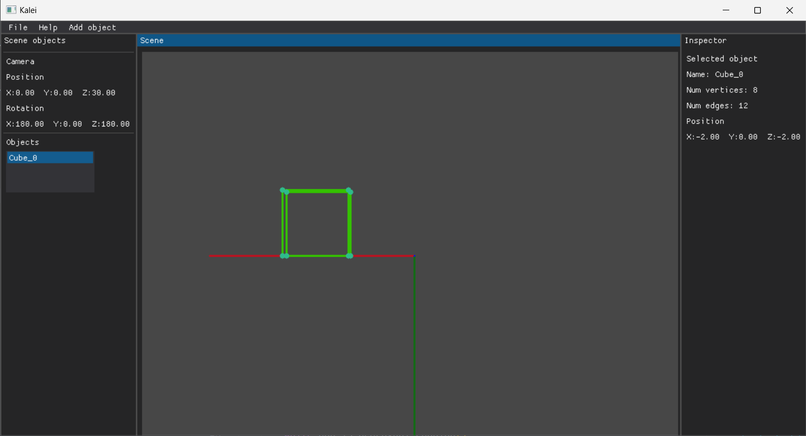

# Kalei - A 3D visualization tool written in Python

> :warning: **This tool is being created, not stable yet**: This tool is developped for my own visualization needs and to learn about 3D rendering. I wouldn't advise to use it just yet

## What is is?

Kalei is a free 3D visualization tool written in Python (this might change in the future). The goal is to provide an easy way to render simple 3d shapes and 3d transforms.
The goal is to be able to visualize 3d sequences from various files:
- .obj
- .c3d

And to allow users to add more thanks to plugins.

